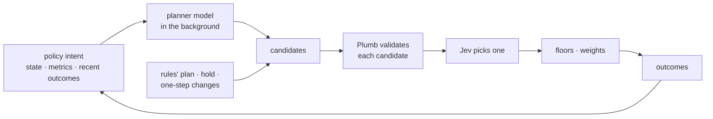

# Architecture

Plumb adds a slow, deliberate fleet loop on top of the fast per-cluster loops you already run. It never replaces them.

| Loop | Time scale | Who | What |
|---|---|---|---|
| Scheduling and scaling | ms – s | kube-scheduler, KEDA/HPA, Karpenter | Place pods, scale replicas, launch nodes. Plumb does not touch these. |
| Member | seconds | `plumb agent`, in every cluster | Observe the cluster and report it |
| Fleet | tens of seconds – minutes | the elected hub (one `plumb agent`) | Move capacity and traffic between clusters |

## Scope: knobs, not mechanisms

Plumb is a control plane. It decides from metrics and SLOs, and turns the knobs other components expose. It never takes over what those components do.

| Plumb sets | The mechanism, which stays where it is |
|---|---|
| A replica floor per cluster (KEDA external scaler) | KEDA/HPA scale the Deployment; kube-scheduler places pods |
| Cluster-level HTTPRoute backend weights | Your gateway routes each request. Inside a cluster, per-request and per-pod choices (e.g. KV-cache-aware routing with the Gateway API Inference Extension's InferencePool and endpoint picker) stay with that layer |

The two routing layers work at different scales. Plumb moves a cluster's share of traffic every tens of seconds; the in-cluster layer picks a pod for every request. If Plumb tried to steer requests, the two would fight.

## Components

Each member cluster runs the same two Deployments from the Helm chart:

- **`plumb agent`** (2 replicas; one is elected per cluster through a local Lease). It has three jobs:
  - **Member reconciler.** For every `AdaptivePolicy` that lists this cluster, writes `status.report`. The report holds desired, ready and unschedulable replicas, and static and dynamic room. It also counts recent launch failures (from Karpenter informers) and records the Prometheus signals and metrics the policy names. It computes how many replicas are missing and since when. It changes nothing in its cluster: KEDA and Karpenter already handle what a cluster can handle alone, including Karpenter trying another capacity type after a launch failure when the NodePool allows it.
  - **Fleet.** Connects to every other member listed as a ClusterProfile, and keeps an informer cache of their `AdaptivePolicy` objects.
  - **Hub candidate.** Stands in the fleet-wide election and, while elected, plans for every policy.
- **`plumb scaler`** (2 replicas). A KEDA external scaler that serves the replica floor the hub asks of this cluster. It reads only informer caches, so it is never slower than KEDA's own loop.

There is no database and no central service. State lives in the `AdaptivePolicy` status of each member, with one writer per field. Each writer patches the difference between the status it read and the one it wants, so a field it drops is removed and the other writers' fields are never touched:

| Field | Written by | Meaning |
|---|---|---|
| `status.report` | the member itself | this cluster's observation, refreshed every `--interval` |
| `status.intent` | the hub | replica floor for this cluster, its expiry, and which hub wrote it |
| `status.fleet` | the hub, on its own copy | phase, per-cluster plan, last decision, decisions being followed and recent outcomes |
| `status.conditions` | the member itself | `Ready` |

The same `AdaptivePolicy` spec is applied to every member (GitOps is the natural fit). Each report carries a hash of the spec it was computed from, and the hub ignores reports from a member whose copy differs from its own.

## Membership

Members are listed with SIG-Multicluster [ClusterProfile](https://github.com/kubernetes-sigs/cluster-inventory-api) objects in Plumb's namespace, one for each other member. Credentials come from the profile's `status.accessProviders`, resolved through the KEP-5339 exec-plugin mechanism (`--clusterprofile-provider-file`).

Adding a ClusterProfile adds a member to a running fleet, and deleting one removes it.

## Hub election

Every member keeps a `coordination.k8s.io/v1` Lease named `plumb-hub` in Plumb's namespace. The hub is elected with client-go's standard `leaderelection.LeaderElector`. Only the lock is Plumb's: a quorum lock over the members' Leases.

- A **read** returns the holder that most members name. On a tie, the latest renewal wins.
- A **write** is a compare-and-swap against each Lease's `resourceVersion`, and succeeds only on a **majority** of members. A Lease that changed since it was read is never overwritten.
- **Every listed member votes**, connected or not. A member that cannot reach its peers can therefore never elect itself.
- Timing is the Kubernetes default: 15s lease, 10s renew deadline, 2s retry.

So a partition's minority side cannot elect a hub. A two-member fleet needs both members to elect one, and three or more tolerate losing a minority. With no hub, nothing breaks: see [failure modes](#failure-modes).

Membership changes one member at a time. ClusterProfiles are created in each member separately, so while a change rolls out, members may count different fleets. Adding or removing one member keeps any two majorities overlapping; adding two at once in one member does not.

### Fencing

A hub that has lost its lease may keep acting until its renew deadline passes. Plumb makes such writes harmless:

- The **scaler** serves an intent only if the intent's `hub` is the holder named by this member's own copy of the hub Lease, the Lease has not expired, and the intent itself has not expired.
- The **hub** writes HTTPRoute weights only after checking that the route cluster's copy of the Lease names it.

## Planning

At least every `--hub-interval` (10s), and sooner when another member's report changes, the hub runs `core.Plan` for each policy. `core.Plan` is a pure function of the members' reports, the current floors and weights, and the previous phase:

```text
Steady ──(a member short, and its own nodes can't fix it: see Placement)──▶ Escalated
Escalated ──(no member short)──▶ Recovering ──(calm for `calmFor`, floors and weights back)──▶ Steady
Recovering ──(a member short again)──▶ Escalated
```

### Placement

A shortage is first its own cluster's to solve, and the fleet is the fallback. `spec.placement` picks the order:

| | `LocalFirst` (default) | `StaticFirst` |
|---|---|---|
| 1 | own static room | own static room |
| 2 | own dynamic room | other members' static room |
| 3 | other members' static room | own dynamic room |
| 4 | other members' dynamic room | other members' dynamic room |

- *Static room* is existing nodes (reserved ones included); *dynamic room* is what the NodePools may still add.
- The member's own rows need no hub: its scheduler places pods on existing nodes, and KEDA and Karpenter scale into its NodePools. The hub decides only **when the other members' rows start**, and it takes their static room before their dynamic room.
- **Own dynamic room is used up** when the member lists no NodePools, they are at their limits, or launches keep failing (dynamic room counts as zero after recurring insufficient-capacity errors). The fleet then steps in once the member has been short for `earlyAfter`.
- **Otherwise the member keeps trying on its own** for up to `after`. If it is still short then, whatever its NodePools report, the fleet steps in.
- **With `StaticFirst`**, other members' idle static room is lent after `earlyAfter` even while the member could still add nodes. Before `after`, only static room is used. Other members' NodePools wait until the member's own can't help.

Capacity is given back in the reverse order: other members' dynamic floors first, then static ones.

**Regions.** Clusters in one region compete for the same cloud capacity. While any member keeps failing to launch nodes (recurring insufficient-capacity errors, the short member included), the other members in its region go last for new nodes: other regions' dynamic room is used first, and theirs only if that is not enough. Their existing nodes are not affected. A cluster's region is `spec.clusters[].region`, else the `topology.kubernetes.io/region` label its member finds on its nodes; clusters without one are never grouped.

Only what the policy registers is Plumb's: in each member, the listed `nodePools` (their nodes and their limits) and the nodes no NodePool manages that match `nodeSelector`. Other NodePools and nodes count for nothing, though other policies' replicas on them are still placed first when working out contention. The pod template should keep the workload on the registered nodes; Plumb does not change where pods go.

### Waiting for ready replicas

The hub follows every floor it raised until the cluster has that many ready replicas. Past `spec.escalation.readyTimeout`:

- **Replicas not on a node** (not created yet, or unschedulable) are taken back, so the shortage is placed elsewhere in the same step, and that member takes no floor for another `readyTimeout`.
- **Replicas on nodes but not ready** stay: a large model may still be loading. The hub records a warning in the decision log and a `ReplicasNotReady` event, and checks again after another `readyTimeout`.

The clock lives in the hub's own `status.fleet`; a new hub restarts it, which can only delay taking floors back. Shadow mode does not follow floors, which never become replicas there.


At most one step per `cooldown`. Each step does the following:

1. **Waiting replicas.** Floors whose replicas missed `readyTimeout` are handled first (see [above](#waiting-for-ready-replicas)).
2. **Missing replicas.**
   - Each member reports what it needs: unschedulable replicas, demand beyond its desired replicas (`ceil(demand / replicaCapacity)`), and at least `step` while saturated or slower than `latencySLO`.
   - The hub subtracts every replica it has already added for the shortage, ready or not. A short member's own need doesn't shrink when capacity appears elsewhere: its autoscaler still wants the replicas until traffic moves. So added replicas are what offset it. The count travels with the floor in the member's intent, which keeps it across failed writes and failovers.
3. **Candidates.** Fresh reports from the other members (not short themselves, not skipped), with headroom under `maxReplicas`, and room left.
   - Static room: replicas that fit on existing nodes.
   - Dynamic room: NodePool limits minus usage. It counts as zero after recurring launch failures.
4. **Ranking.** The rules rank: static room, fewer launch failures, cost rank, more room, name.
   - *Experimental:* with a model configured and at least two candidates, the model gets a compact per-cluster summary and one typed question: which cluster should add replicas first.
   - In `shadow` mode (the default when a model is configured) its answer is only recorded in the decision log, next to what the rules decided.
   - In `apply` mode its probabilities order the candidates when the top one reaches `confidenceThresholdPercent`.
5. **Allocation.** Two passes over the ranking, one per **tier**: static room (tier 0), then dynamic room (tier 1), the latter only for shortages the fleet may launch nodes for (see [Placement](#placement)).
   - The model can reorder clusters within a tier, never across tiers.
   - Each cluster gains at most `step` replicas per step. Floors are absolute: `max(current floor, desired) + added`.
   - A cluster whose report predates the last floor the hub wrote there, for any policy, takes nothing in that step. Its room does not reflect that promise yet.
   - **Shared capacity.** Every member counts other policies' floors before reporting room. Replicas promised in its cluster but not on a node yet (hub floors KEDA has not realized, pods waiting to be scheduled) are placed first in its simulation, on the nodes they would take. What doesn't fit is charged to NodePool headroom. So two policies are never offered the same GPUs.
6. **Traffic.** While any floor is held or any member is short:
   - **With `signals.pressure`** (e.g. waiting requests per replica, KV-cache usage), the hub balances pressure. Each step it moves up to `stepPercent` from the busiest cluster to the least busy one.
     - Nothing moves while the two are within 20% of each other.
     - Nothing moves until both clusters have reported *after* the previous step, so a cluster that already feels the last shift is never compared with one that doesn't yet.
     - Ready replicas are only a prior; the measured pressure corrects it, whatever the GPU type, request lengths, concurrency or KV-cache state.
   - **Without pressure**, each cluster's target share is proportional to `readyReplicas × replicaCapacity`.
   - **In both modes:**
     - A cluster over its `latencySLO` or `errorRateSLO` never gains traffic.
     - In pressure mode, such a cluster is drained first.
     - Shares stay within `[minWeight, maxWeight]`.

   Otherwise the target is the cluster's Steady `weight`.
7. **Release.** After `calmFor` in Recovering:
   - Floors drop by `step`, highest tier first: the reverse of the order they were taken. Dynamic floors go before static ones, so Karpenter consolidates what it added while reserved and existing nodes stay in use.
   - Then weights return to Steady.

The rules (or, experimentally, the model) decide *where*; the policy and arithmetic decide *how much*. A model failure, timeout, open circuit breaker or low confidence falls back to the rules within the same step.

## Experimental: the adaptive path

For a policy with `spec.experimental.adaptive`, on agents run with a planner and Jev, the hub does not follow the rules above step by step. The operator gives an intent in plain words and metrics with their meaning; the models decide where, how much and when, and Plumb keeps every decision within the limits.



1. **Planner (background).** While a member is short or the fleet is not Steady, at most once per `--planner-interval`, the planner model gets the intent, each cluster's state and metrics (value, unit, meaning, age) and what followed recent decisions. It proposes up to 3 plans made of actions: add replicas to a cluster's floor, release some, shift traffic between two clusters. Hub steps never wait for it: its plans join the candidates of the steps after they arrive, until newer ones come or they are two intervals old.
2. **Candidates.** Each step offers the planner's plans, the rules' own plan, holding, and every one-step change the limits allow, so Jev is never limited to what the planner thought of.
3. **Validation.** Every candidate is checked, action by action, on the state the previous action leaves: the cluster exists; `maxReplicas`, `step` and `stepPercent`; room left after other policies' reservations; the Hold rule; traffic only to clusters with ready replicas and within their SLO and weight bounds; nothing but holding within the cooldown. Invalid and duplicate candidates are dropped, with the reason logged. The placement order is not enforced here: it is a preference the models are told.
4. **Choice.** Jev gets the intent, the observations, each plan's validated changes, past times to ready where a plan adds capacity, and the planner's hypothesis for its own plans, each kept apart and labelled, and picks one. Below `confidenceThresholdPercent`, on an error, or with a single candidate, the rules' plan runs (holding, when the constraints reject it).
5. **Mode.** In `shadow` the rules' plan runs and Jev's pick is recorded; in `apply` Jev's pick runs, through the same floors, route weights and fencing as the rules' plans.

The decision log records every candidate, every rejection, Jev's probabilities, and what ran (`adaptive`), and each planner answer as a `proposal` line.

## Apply

In `auto` mode the hub:

- writes each changed floor to the member's `status.intent`, with a 5-minute expiry it renews while the floor is held;
- writes each changed weight to every configured HTTPRoute.

In `shadow` mode it writes neither, and simulates floors and weights forward in `status.fleet` so the plan can be reviewed as it would have unfolded.

Every step that changes something is recorded in three places:

- `status.fleet.lastDecision`
- an Event on the hub's copy of the policy
- a JSONL decision-log line: reports, model answer, plan before and after, applied or not, errors

## Outcomes

A decision record says what the hub saw and did. **Outcome records** say what happened next, joined by the same `decisionId`. After each decision the hub follows it, persisted in `status.fleet.tracking` so a new hub carries on after a failover:

- **Readiness.** For each floor it raised: when that cluster first reported that many ready replicas. This is also exported as `plumb_decision_time_to_ready_seconds`.
- **Checkpoints.** At 1, 5 and 15 minutes: every cluster's ready, desired and needed replicas, floor, weight, demand, pressure, latency and error rate.
- **Follow-ups.** Later decisions for the same policy: more capacity, another shift, a release.

Outcomes record observations, not verdicts. Demand moves on its own, so judging a decision is left to whoever reads the log, with the decision record's reports as the baseline. The same log is a dataset for evaluating a ranking model, or the policy itself, on your own traffic.

## Failure modes

| Failure | What happens |
|---|---|
| Hub process dies | Another member takes over within about one lease duration (15s) and adopts current floors from the members' intents and weights from the routes |
| Member unreachable | Its report goes stale after 2 minutes and it stops being a candidate. Its route share is held as is. Floors and weights elsewhere keep working |
| Minority of members partitioned | The majority side keeps (or elects) the hub. The minority side has none |
| No hub at all (e.g. 2-member fleet split) | Intents expire after 5 minutes and every cluster runs on its own KEDA/Karpenter behaviour. Route weights stay where they were |
| Model down, slow or unsure | Rules rank the clusters in the same step. After 3 consecutive failures the model is skipped for a minute |
| Planner down or slow (adaptive path) | Steps never wait for it: Jev picks among the rules' plan, holding and the one-step changes. The failure is logged as a `proposal` line with its error |
| Prometheus down | The report omits the metric signals, and the policy's `Ready` condition turns false with the error. Unschedulable replicas still count. Without pressure, traffic falls back to following ready capacity |
| Metrics lag | Pressure balancing waits for reports taken after the last step. Set `cooldown` longer than the signal's lag (scrape interval plus query window), or reports will not reflect the previous shift yet |
| Policy copies differ | The hub ignores reports whose spec hash differs from its own copy |
| Two running fleets merged | Both hubs may act until one fails to renew (≤ 10s). Fencing voids the deposed hub's floors and route writes |

## Code layout

```
api/v1alpha1/          AdaptivePolicy types
cmd/plumb/             `plumb agent`, `plumb scaler`, `plumb version`
internal/core/         plan.go (the rules), adaptive.go and planner.go (the experimental adaptive path and planner registry), model.go (System One client and provider registry), provider_*.go (one file per model host), log.go (decision log)
internal/controller/   member.go (reports, reservations, wiring), fleet.go (ClusterProfiles, quorum lock, election), hub.go, metrics.go
internal/adapters/     provider-neutral interfaces, placement simulation, Prometheus, Gateway API
internal/adapters/karpenter/  Karpenter v1 on any cloud: static and dynamic room, launch failures (constants verified against source); providers register what their cloud adds
internal/adapters/aws/ karpenter.go (the AWS provider: EC2 error codes, its launch reasons and node labels), bedrock.go (planner on Bedrock)
internal/scaler/       KEDA external scaler (externalscaler/ holds KEDA's .proto)
charts/plumb/          Helm chart; CRD and ClusterRole are generated into it
test/e2e/              two-cluster e2e on KWOK fake GPU nodes
```

Cloud-specific code stays under `internal/adapters/<provider>/`; `internal/adapters/boundary_test.go` enforces it.
