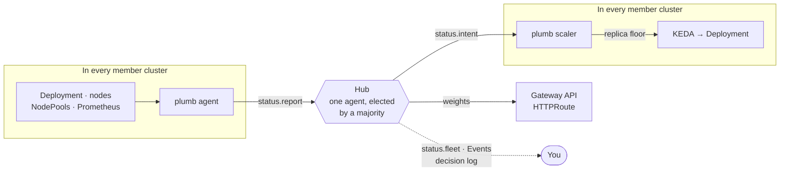
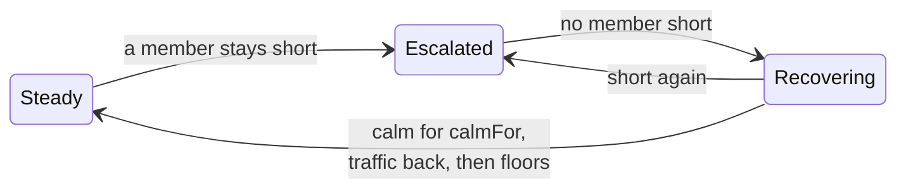
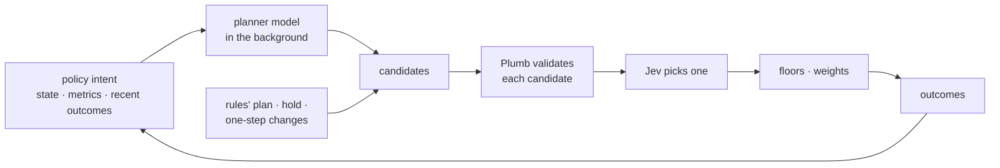

# Architecture

This page explains how Plumb works, from the big picture down to the details. The first three sections are enough to operate it; the rest is there when you need to know exactly why the hub did something.

- [At a glance](#at-a-glance)
- [Scope: knobs, not mechanisms](#scope-knobs-not-mechanisms)
- [A shortage, start to finish](#a-shortage-start-to-finish)
- [Placement](#placement): which capacity is used first
- [Waiting for ready replicas](#waiting-for-ready-replicas)
- [Traffic](#traffic)
- [Where the state lives](#where-the-state-lives)
- [Hub election](#hub-election) and [fencing](#fencing)
- [Failure modes](#failure-modes)
- [The planning step in detail](#the-planning-step-in-detail)
- [Outcomes](#outcomes)
- [Experimental: the models](#experimental-the-models)

## At a glance

- **Every cluster is a member** and runs the same Helm chart: `plumb agent` and `plumb scaler`.
- **The agent reports** its cluster to its own copy of the `AdaptivePolicy`: replicas desired, ready and waiting for a node; room left on existing nodes and in NodePools; launch failures; Prometheus signals. It changes nothing in its cluster.
- **One agent is the hub**, elected by a majority of members. It reads every member's report, plans, and turns two knobs: a replica floor per cluster (served to KEDA by that cluster's scaler) and the HTTPRoute backend weights.
- **You** see every decision in the hub's `status.fleet`, as Events, and in a JSONL decision log.

Plumb adds a slow, deliberate fleet loop on top of the fast per-cluster loops you already run. It never replaces them:

| Loop | Time scale | Who | What |
|---|---|---|---|
| Scheduling and scaling | ms – s | kube-scheduler, KEDA/HPA, Karpenter | Place pods, scale replicas, launch nodes. Plumb does not touch these. |
| Member | seconds | `plumb agent`, in every cluster | Observe the cluster and report it |
| Fleet | tens of seconds – minutes | the elected hub | Move capacity and traffic between clusters |

## Scope: knobs, not mechanisms

Plumb decides from metrics and SLOs and turns knobs other components already read. It never does their job.

| Plumb sets | The mechanism, which stays where it is |
|---|---|
| A replica floor per cluster (KEDA external scaler) | KEDA/HPA scale the Deployment; kube-scheduler places pods; Karpenter launches nodes, including trying another capacity type after a failed launch when the NodePool allows it |
| Cluster-level HTTPRoute backend weights | Your gateway routes each request. Per-request and per-pod choices inside a cluster (e.g. KV-cache-aware routing with the Gateway API Inference Extension) stay with that layer |

Plumb never creates or deletes nodes or pods and never edits NodePools. The two routing layers work at different scales: Plumb moves a cluster's share of traffic every tens of seconds, the in-cluster layer picks a pod for every request. If Plumb steered requests, the two would fight.

## A shortage, start to finish

Take two members, `use1` and `usw2`, with the default `LocalFirst` placement. Traffic grows in `use1`.

1. **`use1` handles it alone first.** KEDA adds replicas, the scheduler fills existing nodes, Karpenter launches nodes in the registered NodePools. The hub only watches.
2. **`use1` stays short.** Its report shows replicas it needs and cannot run. If its NodePools cannot help (none registered, at their limits, or launches keep failing), the hub steps in after `earlyAfter`; otherwise it gives `use1` up to `after` to catch up.
3. **The hub borrows capacity.** It raises `usw2`'s replica floor by at most `step`: idle existing nodes first, new nodes only if those are not enough. `usw2`'s scaler serves the floor to KEDA, which scales the Deployment there.
4. **It waits for the replicas to be ready.** If they never reach a node within `readyTimeout`, the floor is taken back and the shortage placed elsewhere. If they are on nodes but still loading, the hub only warns.
5. **Traffic follows ready capacity.** HTTPRoute weights move toward `usw2` by at most `stepPercent` per step, and never toward a cluster over its SLO.
6. **Everything is given back, slowly.** While `usw2` serves well, nothing moves. Once no member is short and the fleet has been calm for `calmFor`, traffic comes back to `use1` one `stepPercent` step per `calmFor`, and only as far as `use1`'s replicas have been seen to serve without a shortage. If `use1` needs more replicas to take it back and can get them, the hub raises `use1`'s floor first, and the traffic follows once they are ready: borrowing in reverse. When `usw2` carries no borrowed traffic, its floors come down by `step`, newest capacity first, and `use1`'s floor goes last. If `use1` can't take the traffic back or grow, `usw2` keeps serving it.

The fleet moves through three phases on the way:

At most one step per `cooldown`, and every timing value is the policy's own, so a large model can wait longer than a small one. In `shadow` mode (the default) the hub decides the same way but writes nothing, and simulates the plan forward in `status.fleet` for you to review.

## Placement

A shortage is first its own cluster's to solve; the fleet is the fallback. `spec.placement` picks the order:

| | `LocalFirst` (default) | `StaticFirst` |
|---|---|---|
| 1 | own existing nodes | own existing nodes |
| 2 | own NodePools | other members' existing nodes |
| 3 | other members' existing nodes | own NodePools |
| 4 | other members' NodePools | other members' NodePools |

*Static room* is existing nodes, reserved ones included. *Dynamic room* is what the NodePools may still add. Static room on NodePool nodes lasts only as long as Karpenter keeps them: with its default consolidation (`consolidateAfter: 0s`), an empty node is removed within moments, so GPUs meant to be lent should be registered outside NodePools or protected from consolidation (see the [operations checklist](operations.md#checklist-know-these-before-you-run-it)).

- **The member's own rows need no hub.** Its scheduler, KEDA and Karpenter do them. The hub decides only when the other members' rows start, and takes their static room before their dynamic room.
- **Own dynamic room is used up** when the member registers no NodePools, they are at their limits, or launches keep failing (dynamic room counts as zero after recurring insufficient-capacity errors). The fleet then steps in once the member has been short for `earlyAfter`.
- **Otherwise the member keeps trying on its own** for up to `after`. If it is still short then, the fleet steps in whatever its NodePools report.
- **With `StaticFirst`**, other members' idle existing nodes are lent after `earlyAfter` even while the member could still add nodes. Before `after`, only static room is used; other members' NodePools wait until the member's own can't help.
- **Given back in reverse:** other members' dynamic floors first, then static ones.

**Regions.** Clusters in one region compete for the same cloud capacity. While any member keeps failing to launch nodes, the other members in its region go last for new nodes: other regions' dynamic room is used first. Their existing nodes are not affected. A cluster's region is `spec.clusters[].region`, else the `topology.kubernetes.io/region` label its member finds on its nodes; clusters without one are never grouped.

**Only what you register counts.** In each member, the listed `nodePools` (their nodes and limits) and the nodes no NodePool manages that match `nodeSelector`. Other NodePools and nodes count for nothing, though other policies' replicas on them are still placed first when working out contention. Plumb does not change where pods go: the pod template should keep the workload on the registered nodes.

Existing-node room is found by a placement simulation that applies the scheduler's hard constraints (affinity, taints, topology spread, pod (anti-)affinity, resources).

### Shared capacity

Several policies can draw on the same nodes without being offered the same GPUs. Before reporting room, every member places the replicas other policies were promised in its cluster but do not have on a node yet (hub floors KEDA has not realized, pods waiting to be scheduled) on the nodes they would take. What doesn't fit is charged to NodePool headroom. And the hub gives a member nothing more until it has reported again after the hub's last floor there, for any policy.

## Waiting for ready replicas

The hub follows every floor it raised until the cluster has that many ready replicas. Past `spec.escalation.readyTimeout`:

- **Replicas not on a node** (not created yet, or unschedulable) are taken back, the shortage is placed elsewhere in the same step, and that member takes no floor for another `readyTimeout`.
- **Replicas on nodes but not ready** stay: a large model may still be loading. The hub records a warning in the decision log and a `ReplicasNotReady` Event, and checks again after another `readyTimeout`.

The clock lives in `status.fleet`, so a new hub picks it up. Shadow mode does not follow floors, which never become replicas there.

## Traffic

Traffic moves for two reasons only, and otherwise stays where it is: a split that serves well is left alone.

**Relief**, while a member is short (Escalated) or any cluster is over its SLO:

- **With `signals.pressure`** (e.g. waiting requests per replica, KV-cache usage), it balances pressure: each step moves up to `stepPercent` from the busiest cluster to the least busy one. Nothing moves while the two are within 20% of each other, or until both have reported after the previous shift. Ready replicas are only a prior; measured pressure corrects it, whatever the GPU type, request lengths or cache state.
- **Without pressure**, each cluster's share is proportional to `readyReplicas × replicaCapacity`.
- **Always:** a cluster over its `latencySLO` or `errorRateSLO` never gains traffic (in pressure mode it is drained first), and shares stay within `[minWeight, maxWeight]`.

**Return**, once no member has been short for `calmFor` (Recovering): traffic comes back toward the Steady `weight`s, never toward borrowed capacity.

- One `stepPercent` step per `calmFor`, from the cluster furthest above its Steady weight (the tier taken last first) to the one furthest below.
- With pressure, a step is taken only if the receiver's pressure afterwards stays within what a replica of the workload has been seen to serve without a shortage. That is the receiver's own `status.report.safePressure` (the highest in the last day), or the donor's, converted by the clusters' `replicaCapacity`. Otherwise the split holds, and the borrowed capacity keeps serving. So if home can't take the traffic back, nothing moves back and forth.
- Without pressure there is nothing to judge by: steps are simply a `calmFor` apart.
- A shortage stops the return at once.

**Home first.** When the next step can't come back because the receiver's replicas would be too busy, but the receiver has room to grow (existing nodes or NodePool headroom), the hub raises its floor to the replicas that would carry all the borrowed traffic within that limit, `step` at a time. Its pending replicas are not counted as a shortage. Once they are ready, the return proceeds; if they never reach a node within `readyTimeout`, they are taken back and the borrowed capacity keeps serving. This needs pressure, which sizes the floor.

A floor is released only once its cluster carries no more than its Steady share, and the floor raised for the return only after every borrowed floor is gone and all traffic is back (see [release](#the-planning-step-in-detail)). The fleet is Steady again when no floor is left and every share is back.

## Where the state lives

There is no database and no central service. State lives in each member's copy of the `AdaptivePolicy`, one writer per field. Each writer patches only the difference from what it read, so it never touches another writer's field.

| Field | Written by | Meaning |
|---|---|---|
| `status.report` | the member itself | this cluster's observation, refreshed every `--interval` |
| `status.intent` | the hub | replica floor for this cluster, its expiry (5 minutes, renewed while held), and which hub wrote it |
| `status.fleet` | the hub, on its own copy | phase, per-cluster plan, last decision, decisions being followed, recent outcomes, members out of sync |
| `status.conditions` | the member itself | `Ready` |

**Apply the same spec in every member** (GitOps is the natural fit). Each report carries a hash of the spec fields it was computed from: the workload, signals, capacity and the member's own `clusters[]` entry. The hub computes the same hash from its own copy and ignores a report that differs, listing the member in `status.fleet.outOfSync`. Fields only the hub reads (intent, escalation timing, weights, placement, other clusters' entries) take effect as soon as the hub's copy has them. Decisions and planner plans are tied to the hub's whole spec: a change drops any made on the earlier one.

Every step that changes something is recorded in `status.fleet.lastDecision`, as an Event on the hub's copy, and as a decision-log line with the reports seen, the model's answer, the plan before and after, and whether it was applied.

## Membership

Members are listed with SIG-Multicluster [ClusterProfile](https://github.com/kubernetes-sigs/cluster-inventory-api) objects in Plumb's namespace, one for each other member. Credentials come from the profile's `status.accessProviders`, resolved through the KEP-5339 exec-plugin mechanism (`--clusterprofile-provider-file`). Adding a ClusterProfile adds a member to a running fleet; deleting one removes it.

Each agent (2 replicas, one elected per cluster through a local Lease) keeps an informer cache of the other members' `AdaptivePolicy` objects. The scaler (2 replicas) reads only informer caches, so it is never slower than KEDA's own loop.

## Hub election

Every member keeps a `coordination.k8s.io/v1` Lease named `plumb-hub`. The hub is elected with client-go's standard `leaderelection.LeaderElector`; only the lock is Plumb's, a quorum lock over the members' Leases:

- A **read** returns the holder most members name. On a tie, the latest renewal wins.
- A **write** is a compare-and-swap on each Lease's `resourceVersion` and succeeds only on a **majority**. A Lease that changed since it was read is never overwritten.
- **Every listed member votes**, connected or not, so a member cut off from its peers can never elect itself.
- Timing is the Kubernetes default: 15s lease, 10s renew deadline, 2s retry.

A partition's minority side cannot elect a hub. A two-member fleet needs both members; three or more tolerate losing a minority. With no hub nothing breaks: see [failure modes](#failure-modes).

Change membership one member at a time. ClusterProfiles are created in each member separately, so members may count different fleets while a change rolls out. Adding or removing one member keeps any two majorities overlapping; adding two at once does not.

### Fencing

A hub that lost its lease may keep acting until its renew deadline passes. Plumb makes such writes harmless:

- The **scaler** serves a floor only if the intent's `hub` is the holder in this member's own copy of the hub Lease, the Lease has not expired, and the intent has not expired. It serves at most this cluster's `maxReplicas` as its own copy of the policy says now, so lowering it takes effect at once.
- The **hub** writes HTTPRoute weights only after checking that the route cluster's copy of the Lease names it.

## Failure modes

| Failure | What happens |
|---|---|
| Hub process dies | Another member takes over within about 15s. It adopts current floors from the members' intents and weights from the routes, and starts from the most recent `status.fleet` among the members' copies: phase, cooldown, decisions being followed and ready-wait clocks carry over |
| Member unreachable | Its report goes stale after 2 minutes and it stops being a candidate. Its route share is held. Floors and weights elsewhere keep working |
| Minority of members partitioned | The majority side keeps (or elects) the hub. The minority side has none |
| No hub at all (e.g. 2-member fleet split) | Floors expire after 5 minutes and every cluster runs on its own KEDA/Karpenter, as if Plumb were not installed. Route weights stay where they were |
| Model down, slow or unsure | The rules decide in the same step. After 3 consecutive failures the model is skipped for a minute |
| Planner down or slow (adaptive path) | Steps never wait for it: Jev picks among the rules' plan, holding and the one-step changes. The failure is logged as a `proposal` line |
| Prometheus down | The report omits the metric signals and the `Ready` condition turns false. Unschedulable replicas still count. Without pressure, traffic follows ready capacity |
| Metrics lag | Pressure balancing waits for reports taken after the last step. Set `cooldown` longer than the signal's lag (scrape interval plus query window) |
| Policy copies differ | The hub ignores a member's report when the fields it is computed from differ from its own copy, and lists the member in `status.fleet.outOfSync` (metric `plumb_fleet_members_out_of_sync`, Event `MembersOutOfSync`) |
| Two running fleets merged | Both hubs may act until one fails to renew (≤ 10s). Fencing voids the deposed hub's floors and route writes |

## The planning step in detail

At least every `--hub-interval` (10s), and sooner when a member's report changes, the hub runs `core.Plan` for each policy: a pure function of the members' reports, the current floors and weights, and the previous phase. At most one step that changes something per `cooldown`:

1. **Waiting replicas.** Floors whose replicas missed `readyTimeout` are handled first ([above](#waiting-for-ready-replicas)).
2. **Missing replicas.** Each member reports what it needs: unschedulable replicas, demand beyond its desired replicas (`ceil(demand / replicaCapacity)`), and at least `step` while saturated or slower than `latencySLO`. The hub subtracts every replica it has already added for the shortage, ready or not: the short member's own need doesn't shrink when capacity appears elsewhere, because its autoscaler still wants the replicas until traffic moves. The added count travels with the floor in the member's intent, so it survives failed writes and failovers.
3. **Candidates.** Other members with a fresh report, not short themselves, not skipped, with headroom under `maxReplicas` and room left.
4. **Ranking.** Static room, fewer launch failures, cost rank, more room, name. *Experimental:* a model may reorder them ([below](#ranking-model)).
5. **Allocation.** Two passes over the ranking, one per **tier**: static room (tier 0), then dynamic room (tier 1), the latter only when the fleet may launch nodes for this shortage ([placement](#placement)). Each cluster gains at most `step` replicas per step. Floors are absolute: `max(current floor, desired) + added`. A cluster whose report predates the last floor the hub wrote there, for any policy, takes nothing this step.
6. **Traffic.** Weights as described in [traffic](#traffic).
7. **Release.** After `calmFor` in Recovering, floors drop by `step` on clusters whose traffic has come back to their Steady share, highest tier first, so Karpenter consolidates what it added while existing and reserved nodes stay in use; the floor raised for the return goes last, once all traffic is back. A floor drops only on a member that has reported since the hub last raised or lowered a floor there, so releases go one acknowledged step at a time. A member without a usable report (stale, out of sync, or none) keeps its floor, and the hub raises a `ReleaseHeld` Event naming it. A member reporting a shortage again, even one too young to borrow for, ends Recovering, and the calm interval starts over once it clears.

The rules decide *where*; the policy and arithmetic decide *how much*.

In `auto` mode the hub writes each changed floor to the member's `status.intent` and each changed weight to every configured HTTPRoute. In `shadow` mode it writes neither.

## Outcomes

A decision record says what the hub saw and did. **Outcome records** say what happened next, joined by the same `decisionId`. The hub follows each decision in `status.fleet.tracking`, so a new hub carries on after a failover:

- **Readiness.** For each floor it raised: when that cluster first had that many ready replicas (also `plumb_decision_time_to_ready_seconds`).
- **Checkpoints.** At 1, 5 and 15 minutes: every cluster's ready, desired and needed replicas, floor, weight, demand, pressure, latency and error rate.
- **Follow-ups.** Later decisions for the same policy: more capacity, another shift, a release.

Outcomes record observations, not verdicts. Demand moves on its own, so judging a decision is left to whoever reads the log, with the decision's reports as the baseline. The same log is a dataset for evaluating a model, or the policy itself, on your own traffic.

## Experimental: the models

Both are off by default, and both start in shadow: what they would have done is logged next to what the rules did. Any model failure, timeout, open circuit breaker or low confidence falls back to the rules in the same step.

### Ranking model

With a model configured and at least two candidates, the model gets a compact per-cluster summary and one typed question: which cluster should add replicas first. In `shadow` mode its answer is only recorded. In `apply` mode its probabilities order the candidates when the top one reaches `confidenceThresholdPercent`. It can reorder clusters within a tier, never across tiers.

### The adaptive path

For a policy with `spec.experimental.adaptive`, the operator states an intent in plain words and metrics with their meaning; the models decide where, how much and when, and Plumb keeps every decision within the policy's limits.

1. **Planner (background).** While a member is short or the fleet is not Steady, at most once per `--planner-interval`, the planner gets the intent, each cluster's state and metrics (value, unit, meaning, age) and what followed recent decisions. It proposes up to 3 plans of actions: add replicas to a cluster's floor, release some, shift traffic between two clusters. Hub steps never wait for it: its plans join the candidates of the steps after they arrive, until newer ones come or they are two intervals old. A plan is one step: once one is picked the policy's plans are spent, and plans made for an earlier version of the policy are never offered.
2. **Candidates.** Each step offers the planner's plans, the rules' plan, holding, and every one-step change the limits allow.
3. **Validation.** Every candidate is checked action by action on the state the previous action leaves: the cluster exists; `maxReplicas`, `step` and `stepPercent`; room left after other policies' reservations; the rule that a member takes nothing until it reports after the last floor written there; traffic only to clusters with ready replicas, within their SLO and weight bounds; no release while any member reports a shortage, on a member without a report since the last floor written there, or on one still carrying more than its Steady share; with no shortage or SLO breach, traffic only toward the Steady weights, once per `calmFor`, within what the receiver can serve safely; nothing but holding within the cooldown. Invalid and duplicate candidates are dropped with the reason logged. The placement order is a preference the models are told, not a check.
4. **Choice.** Jev gets the intent, the observations, each plan's validated changes, past times to ready, and the planner's hypothesis, each kept apart and labelled, and picks one. Below `confidenceThresholdPercent`, on an error, or with a single candidate, the rules' plan runs.
5. **Mode.** In `shadow` the rules' plan runs and Jev's pick is recorded; in `apply` Jev's pick runs, through the same floors, weights and fencing. If the policy changed while the models were asked, nothing decided on the old one is carried out.

**Planner only** (`--planner-only`, Helm `planner.only`): Jev is not used. The planner gets the same prompt except its last part, which asks for the one plan to carry out. That plan goes through the same validation each step; if it passes it is the pick (`adaptive.chooser: planner`), otherwise, or while none has arrived, the rules' plan runs. It is recorded in `shadow` and carried out in `apply`. No one-step changes are enumerated and there is no confidence threshold. Useful to compare the planner's own judgment with Jev's on the same traffic.

The decision log records every candidate, every rejection, Jev's probabilities and what ran (`adaptive`), and each planner answer as a `proposal` line.
